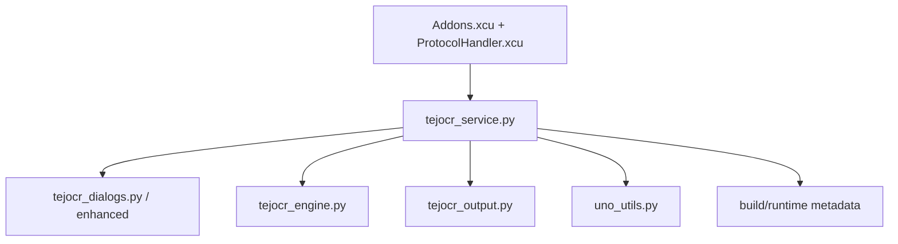
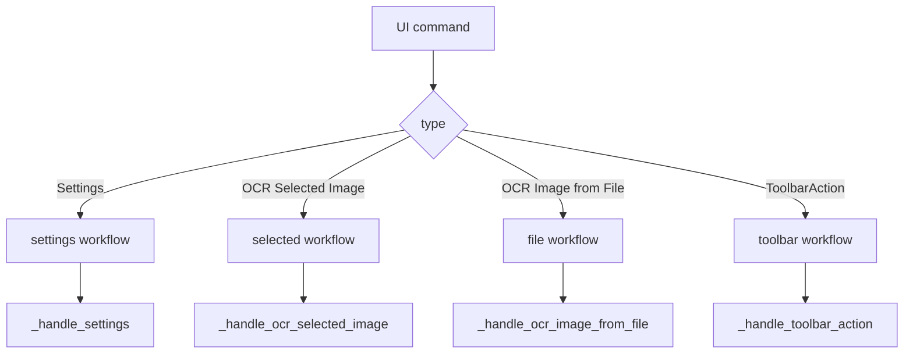

# TejOCR Code Map

Use this as a first-pass map from user intent to module and method.

## Top-level architecture

```text
Addons.xcu / ProtocolHandler.xcu
    |
    v
tejocr_service.py
    |--> dialogs (tejocr_dialogs.py, te jocr_dialogs_enhanced.py)
    |--> engine (tejocr_engine.py)
    |--> output (tejocr_output.py)
    |--> utilities (uno_utils.py)
    |--> settings/resources (description.xml, manifest, xcu)
```



## Module-to-function map

### 1) `python/tejocr/tejocr_service.py`
- `queryDispatch` / `dispatch`
- `_handle_settings()`
- `_handle_ocr_selected_image()`
- `_handle_ocr_image_from_file()`
- `_perform_ocr_with_options()`
- `_ensure_tesseract_is_ready_and_run()`

### 2) `python/tejocr/tejocr_engine.py`
- `perform_ocr`
- `extract_text_from_selected_image`
- `extract_text_from_image_file`
- `_get_image_from_selection`
- `_export_graphic_to_file`
- `_preprocess_image`

### 3) `python/tejocr/tejocr_output.py`
- `handle_ocr_output`
- `_resolve_insertion_cursor`
- `_insert_text_at_cursor`
- `create_text_box_with_text`
- `_replace_image_with_text`
- `copy_text_to_clipboard`

### 4) `python/tejocr/uno_utils.py`
- `show_message_box`
- `show_input_box` / `show_multiline_input_box`
- `create_instance` + `supports_uno_dialog_model`
- `get_setting` / `set_setting`
- `is_graphic_object_selected` / `get_graphic_from_selection`
- `show_file_picker`

### 5) `python/tejocr/tejocr_dialogs.py` (+ enhanced variant)
- `SettingsDialogHandler`
- `OCRDialogHandler`
- `SetupDialog` (dependencies + instructions + command text)

## Flow map by command

```text
Commands from UI
  -> Settings
     -> settings dialog + dependency checks + persist defaults
  -> OCR Selected Image
     -> capture anchor -> options -> OCR -> output
  -> OCR Image from File
     -> picker -> options -> OCR -> output
  -> ToolbarAction
     -> command-specific dispatch branch
```



## Deep docs

- `TECHNICAL.md` (runtime traces)
- `docs/architecture/overview.md`
- `docs/architecture/dispatch-flow.md`
- `docs/reference/method-map.md`
- `docs/reference/uno-apis.md`
- `docs/reference/output-modes.md`
- `docs/flow/selected-image-ocr.md`
- `docs/flow/file-image-ocr.md`
- `docs/troubleshooting/installation.md`
- `docs/troubleshooting/dialog-fallbacks.md`

