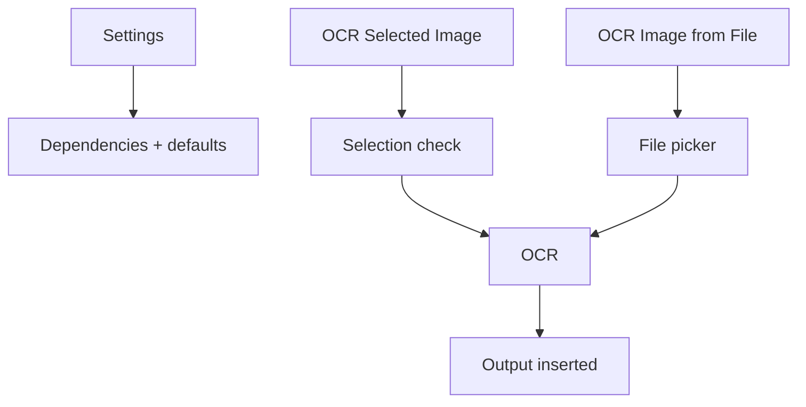
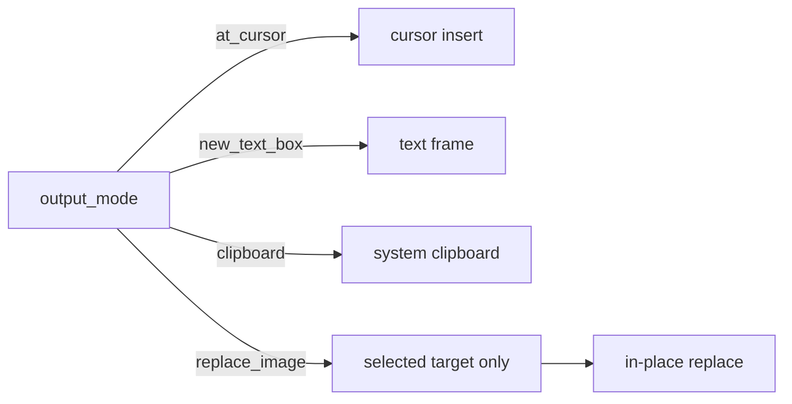

# TejOCR Functionality Guide

This document explains what the user sees and what actually happens inside the extension.

## What actions are available

- Settings
- OCR Selected Image
- OCR Image from File
- Toolbar action (same handler family, resolved by command URL)

## Expected UI behavior

```text
Settings
  -> dependency status + path controls
  -> save defaults

OCR Selected Image
  -> selection check (must be Writer image/shape)
  -> OCR options (or fallback input)
  -> output

OCR Image from File
  -> file picker
  -> OCR options (or fallback input)
  -> output
```



## Output behavior by output mode

| Mode | Selected image input | File input |
|---|---|---|
| `at_cursor` | Insert near selected image anchor (or cursor fallback) | Insert at active cursor |
| `clipboard` | Copy recognized text | Copy recognized text |
| `new_text_box` | Add a text frame in document | Add a text frame at cursor |
| `replace_image` | Replace selected image with text | Converted to safe insertion path |



## What the fallback mode means

In some LibreOffice runtime profiles:
- `com.sun.star.awt.UnoControlDialogModel` may be unavailable
- visual XDL dialogs cannot be created
- OCR still proceeds with saved settings and defaults

Fallback indicators:
- settings or option editor message appears as plain text
- preview box might be skipped and result inserted directly

## Practical recommendation

If cursor insertion is unstable in your workflow, use `new_text_box` mode.
It is the most stable for preserving insertion context across selection changes.

