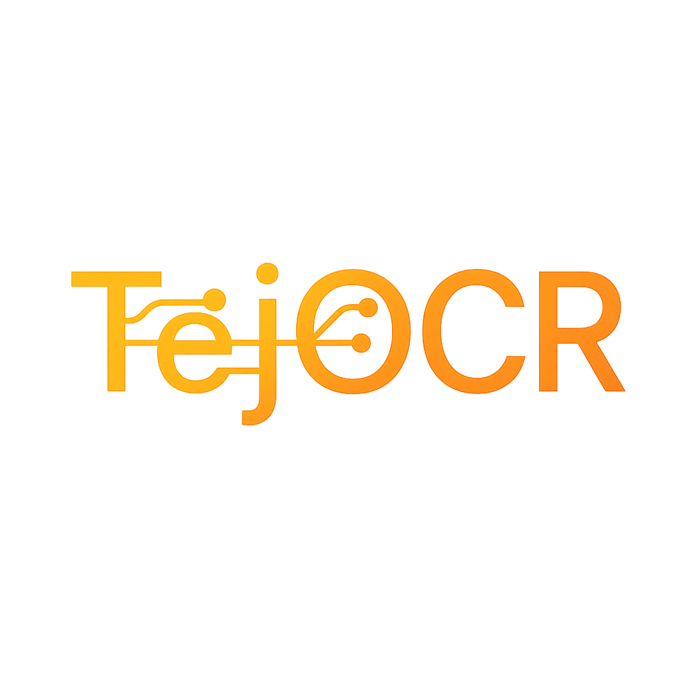

<!-- This Source Code Form is subject to the terms of the Mozilla Public -->
<!-- License, v. 2.0. If a copy of the MPL was not distributed with this -->
<!-- file, You can obtain one at https://mozilla.org/MPL/2.0/. -->
<!-- © 2025 Devansh (Author of TejOCR) -->

<div align="center">
  
</div>

# TejOCR v0.1.5 - LibreOffice OCR Extension

🎉 **Phase 2 Complete: Professional UI/UX with Real Configurable Dialogs!** 

TejOCR is a powerful LibreOffice extension that adds Optical Character Recognition (OCR) capabilities to your documents. Extract text from images directly within LibreOffice Writer.

## ✅ What's New in v0.1.5

**🎨 COMPLETE UI/UX OVERHAUL:**
- ✅ **Real Settings Dialog**: Configurable XDL-based settings with dependency checking
- ✅ **Professional OCR Options Dialog**: Language selection, output modes, advanced options
- ✅ **Smart Workflow Integration**: Seamless dialog flow for both OCR methods
- ✅ **Enhanced User Experience**: Grouped controls, helpful hints, and error guidance

**🔧 MAJOR IMPROVEMENTS:**
- **Dependency Status Dashboard**: Live status checking with installation guidance
- **Tesseract Path Configuration**: Browse, test, and validate Tesseract installation
- **Advanced OCR Options**: Page segmentation modes, engine modes, preprocessing
- **Multiple Output Modes**: Cursor, text box, replace image, clipboard
- **Smart Defaults**: Remembers your preferences between sessions

## 🎯 Current Status

**Phase 1 (Core Stability)**: ✅ **COMPLETE**
- Core OCR functionality fully working
- Multi-strategy error handling
- Robust dependency detection

**Phase 2 (Professional UI/UX)**: ✅ **COMPLETE**
- Real XDL-based dialogs
- Configurable settings system  
- Professional user experience
- Advanced OCR options

**Phase 3 (Advanced Features)**: 🚧 **Next Priority**
- Batch processing capabilities
- Enhanced output formatting
- Performance optimizations

## 🚀 Quick Start

### Prerequisites

1. **Tesseract OCR** (Required):
   ```bash
   # macOS
   brew install tesseract
   
   # Ubuntu/Debian
   sudo apt install tesseract-ocr
   
   # Windows
   # Download from: https://github.com/UB-Mannheim/tesseract/wiki
   ```

2. **Python Dependencies** (for LibreOffice's Python):
   
   **Automated Installation** (Recommended):
   ```bash
   python3 install_dependencies.py
   ```
   
   **Manual Installation**:
   ```bash
   # Get LibreOffice's Python path first
   /Applications/LibreOffice.app/Contents/Frameworks/LibreOfficePython.framework/Versions/Current/bin/python3 -m pip install numpy pytesseract pillow
   ```

### Installation

1. **Download**: Get the latest `TejOCR-0.1.5.oxt` from releases
2. **Install**: LibreOffice → Tools → Extension Manager → Add → Select the .oxt file
3. **Restart**: Close and restart LibreOffice completely
4. **Verify**: Look for "TejOCR" in the top menu bar

### Usage

1. **Open LibreOffice Writer**
2. **Configure Settings**: Tools → TejOCR → Settings (first time setup)
3. **For File OCR**: Tools → TejOCR → OCR Image from File → Select options → Start OCR
4. **For Selected Image**: Insert image → Select it → Tools → TejOCR → OCR Selected Image → Select options → Start OCR

## 🔧 Troubleshooting

### Check Dependencies
Go to **Tools → TejOCR → Settings** to see real-time status:
- ✅ Tesseract: Shows installed version and path
- ✅ Python packages: Shows NumPy, Pytesseract, Pillow status
- 📁 **Browse & Test**: Built-in path finder and validator

### Common Issues

**"Settings dialog won't open"**:
- Check LibreOffice version (4.0+ required)
- Restart LibreOffice completely
- Check extension is properly installed

**"OCR options not working"**:
- Use Settings dialog to verify all dependencies
- Check Tesseract path with built-in tester
- Ensure image is properly selected

### Advanced Configuration
- **Language Selection**: Choose from all installed Tesseract languages
- **Output Modes**: Customize where text appears
- **Page Segmentation**: Optimize for different image types
- **Preprocessing**: Enable image enhancement for better results

## 🏗️ Development

### Building from Source
```bash
git clone <repository>
cd TejOCR
python3 build.py
```

### Project Structure
```
TejOCR/
├── python/tejocr/          # Main Python package
│   ├── constants.py        # Version and configuration constants
│   ├── tejocr_service.py   # Main UNO service with dialog integration
│   ├── tejocr_engine.py    # OCR processing engine
│   ├── tejocr_output.py    # Text insertion handling
│   ├── tejocr_dialogs.py   # Professional XDL dialog handlers
│   └── uno_utils.py        # UNO utilities and helpers
├── dialogs/                # XDL dialog definitions
│   ├── tejocr_settings_dialog.xdl     # Settings UI
│   └── tejocr_options_dialog.xdl      # OCR options UI
├── icons/                  # Extension icons
├── description.xml         # Extension metadata
├── Addons.xcu             # LibreOffice menu/toolbar integration
└── build.py               # Build script
```

## 📝 License

This project is licensed under the Mozilla Public License 2.0 - see the [LICENSE](LICENSE) file for details.

## 🙏 Acknowledgments

- Tesseract OCR team for the excellent OCR engine
- LibreOffice community for extension development resources
- Python community for pytesseract and imaging libraries

---

**Note**: This is v0.1.5 with Phase 2 (Professional UI/UX) complete. Phase 3 (Advanced Features) is coming next!

For detailed changes and technical information, see [CHANGELOG.md](CHANGELOG.md).

## 🧠 About the Name

**Tej** (तेज) in Sanskrit and other Indian languages means *light*, *effulgence*, *sharpness*, or *brilliance*. **TejOCR** aims to bring clarity and insight to your documents by making the text within images accessible and editable.

## 📧 Contact

*   Maintainer: **Devansh Varshney**
*   GitHub: [varshneydevansh](https://github.com/varshneydevansh)
*   Twitter: [@varshneydevansh](https://x.com/varshneydevansh)