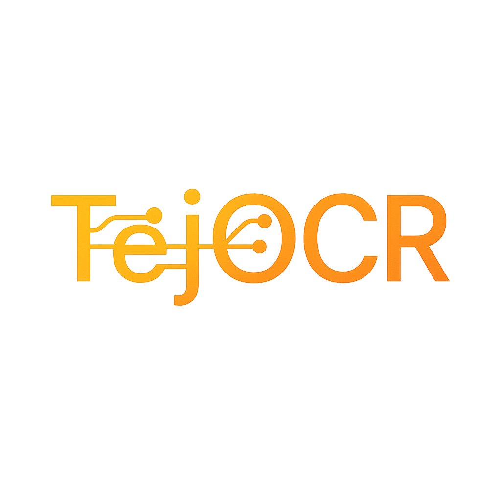
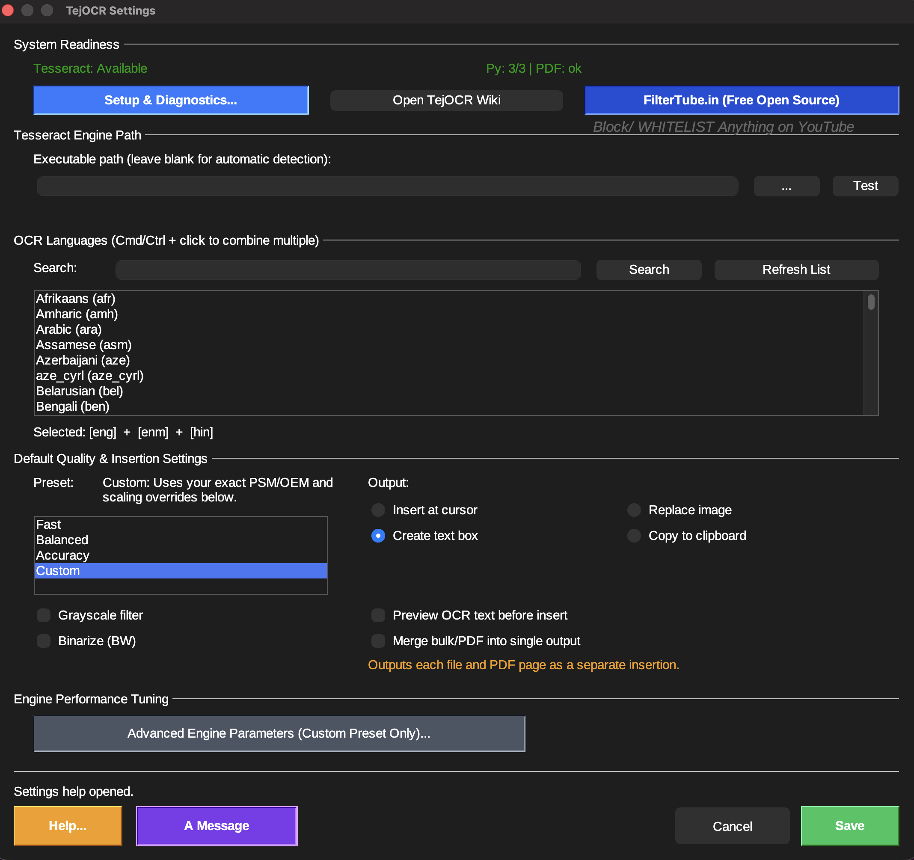
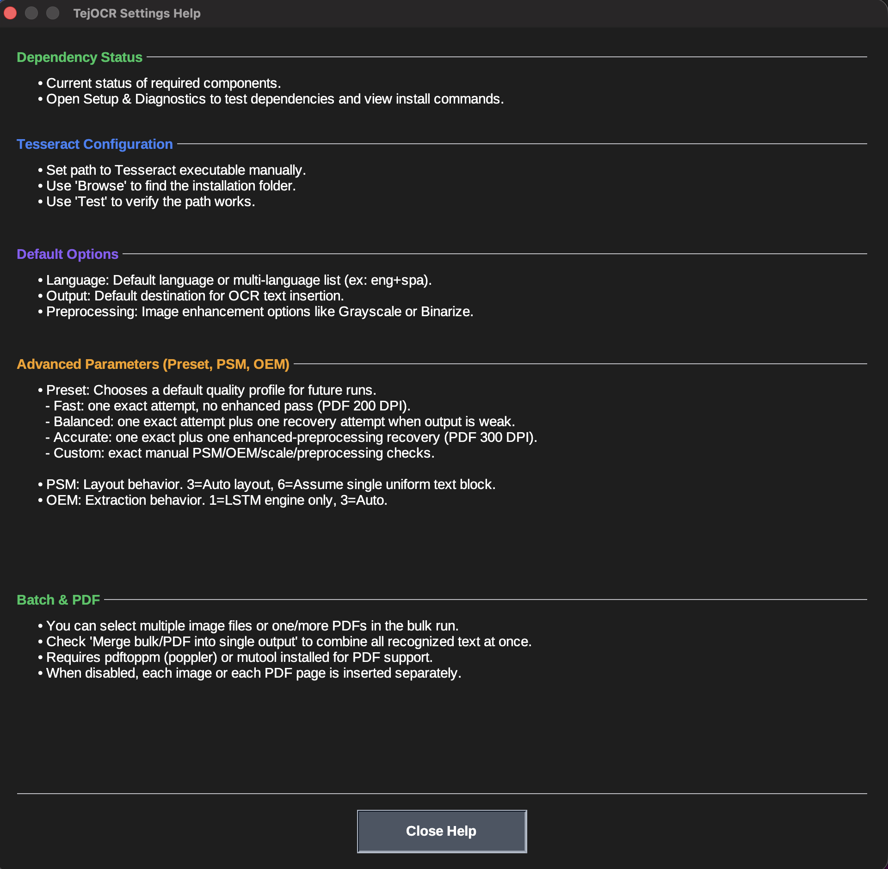
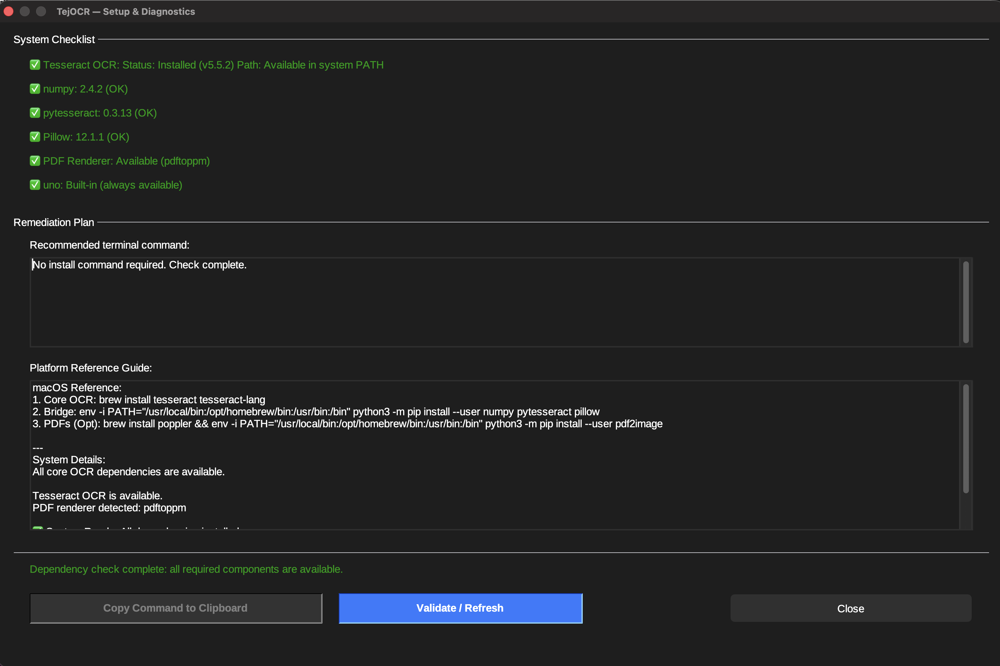
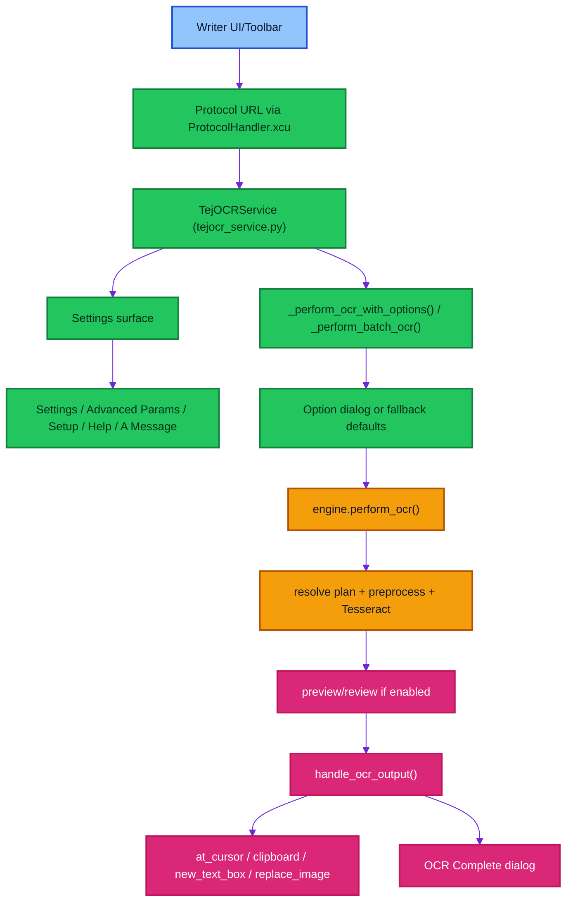
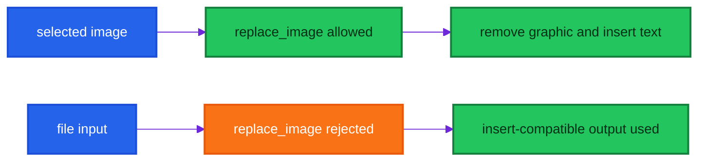

# TejOCR

<div align="center">
  
  <br/><br/>
  <p>OCR inside Writer, with predictable output behavior</p>

  [](https://deepwiki.com/varshneydevansh/TejOCR)
  [](https://github.com/varshneydevansh/TejOCR/releases)
  [](LICENSE)
  [](https://www.libreoffice.org/)
  [](https://github.com/varshneydevansh/TejOCR)
</div>

TejOCR is a **LibreOffice Writer extension** that performs OCR from:

- a Writer-selected image object, or
- a local image file.

The extension inserts recognized text based on the selected output mode with fallbacks for UI or session capability differences.

## What's New In 0.2.1

- `Setup & Diagnostics` is more robust and more honest about what is actually required:
  - LibreOffice Python is called out explicitly,
  - `Tesseract` and `PDF` readiness are separated from optional Python extras,
  - support snapshots and exportable setup scripts are built into the dialog.

- PDF/runtime behavior is safer:
  - OCR/PDF subprocess output is decoded as UTF-8 with replacement,
  - non-ASCII stderr/stdout no longer breaks PDF OCR with ASCII decode crashes.
- Platform docs were tightened, especially for Windows LibreOffice Python and PDF renderer setup.
- Prior UI work from `0.2.0` remains intact:
  - structured `OCR Complete`,
  - polished Settings/Help/Setup surfaces,
  - `6 pt` Writer OCR output default.

## UI snapshots

### Settings Main UI

<p align="center">
  <a href="images/Settings_Main_UI.png">
    
  </a>
</p>

### Help UI

<p align="center">
  <a href="images/Help_UI.png">
    
  </a>
</p>

### Setup & Diagnostics UI

<p align="center">
  <a href="images/Setup_Diagnostics_UI.png">
    
  </a>
</p>


---

## Runtime in one screen (ASCII)

```text
┌─────────────────────┐
│ Writer UI/Toolbar   │
│ (menu/commands)     │
└──────────┬──────────┘
           v
    ┌───────────────────────┐
    │ UNO dispatch URL      │
    │ (ProtocolHandler.xcu) │
    └──────────┬────────────┘
               v
      ┌──────────────────────┐
      │ TejOCRService        │
      │ (tejocr_service.py) │
      └─────┬────────┬───────┘
            │        │
            │        ├─ Settings surface
            │        │    -> Settings
            │        │    -> Advanced Engine Parameters
            │        │    -> Setup & Diagnostics
            │        │    -> Help
            │        │    -> A Message
            │        │
            │        └─ OCR run surface
            │             -> OCR options dialog/fallback
            │             -> Preview / Review fallback
            │             -> OCR Complete
            │
            v
      OCR source
   selected image | file | PDF
            v
      ┌──────────────────────────┐
      │ OCR Engine               │
      │ (tejocr_engine.py)       │
      │ - bounded OCR plan       │
      │ - CLI tesseract runtime  │
      │ - PDF page streaming     │
      │ - requested/effective    │
      └─────────┬────────────────┘
                v
      ┌──────────────────────────┐
      │ Output Router            │
      │ (tejocr_output.py)       │
      │ at_cursor | clipboard    │
      │ new_text_box | replace   │
      │ inserted text -> 6 pt    │
      └──────────────────────────┘
```


```mermaid
%%{init: {"theme":"base","themeVariables":{"lineColor":"#6d28d9","fontSize":"14px","fontFamily":"Inter, Segoe UI, Arial","nodeTextColor":"#111827","textColor":"#111827","lineWidth":"2","signalColor":"#0f766e"}}}%%
flowchart TD
  A["Writer UI/Toolbar"] --> B["Protocol URL via ProtocolHandler.xcu"]
  B --> C["TejOCRService (tejocr_service.py)"]
  C --> D["Settings surface"]
  D --> D1["Settings / Advanced Params / Setup / Help / A Message"]
  C --> E["_perform_ocr_with_options() / _perform_batch_ocr()"]
  E --> F["Option dialog or fallback defaults"]
  F --> G["engine.perform_ocr()"]
  G --> H["resolve plan + preprocess + Tesseract"]
  H --> I["preview/review if enabled"]
  I --> J["handle_ocr_output()"]
  J --> K["at_cursor / clipboard / new_text_box / replace_image"]
  J --> L["OCR Complete dialog"]
  classDef ui fill:#93c5fd,color:#0f172a,stroke:#1d4ed8,stroke-width:2px;
  classDef service fill:#22c55e,color:#052e16,stroke:#15803d,stroke-width:2px;
  classDef engine fill:#f59e0b,color:#0f172a,stroke:#b45309,stroke-width:2px;
  classDef output fill:#db2777,color:#ffffff,stroke:#be185d,stroke-width:2px;
  class A ui;
  class B service;
  class C service;
  class D service;
  class D1 service;
  class E service;
  class F service;
  class G engine;
  class H engine;
  class I output;
  class J output;
  class K output;
  class L output;
```

> `replace_image` is only valid for Writer-selected-image flow.

---

## What it supports

- **Input sources**
  - Selected Writer image
  - Local image file (single or multi-select for batch processing)
  - Multi-page PDF documents (requires `pdftoppm`/`poppler-utils` or `mutool` installed)
- **Output modes**
  - Insert at cursor
  - Copy to clipboard
  - Insert into new text box
  - Replace selected image (selection-only)
- **Compatibility mode**
  - If UNO dialog UI services are unavailable, TejOCR switches to fallback prompts and still runs OCR.

### Important support note

```text
selected image source -> can use replace_image
file source          -> cannot target an image replacement
                       -> automatically uses insertion-compatible behavior
```


```mermaid
%%{init: {"theme":"base","themeVariables":{"lineColor":"#6d28d9","fontSize":"14px","fontFamily":"Inter, Segoe UI, Arial","nodeTextColor":"#111827","textColor":"#111827","lineWidth":"2","signalColor":"#0f766e"}}}%%
flowchart LR
  A["selected image"] --> B["replace_image allowed"]
  B --> C["remove graphic and insert text"]
  D["file input"] --> E["replace_image rejected"] --> F["insert-compatible output used"]
  classDef image fill:#2563eb,color:#ffffff,stroke:#1d4ed8,stroke-width:2px;
  classDef action fill:#22c55e,color:#052e16,stroke:#15803d,stroke-width:2px;
  classDef fallback fill:#f97316,color:#ffffff,stroke:#ea580c,stroke-width:2px;
  class A image;
  class B action;
  class C action;
  class D image;
  class E fallback;
  class F action;
```

---

## Install

1. Install `TejOCR-0.2.1.oxt` from extension manager.
2. Restart LibreOffice.
3. Open **TejOCR → Settings** and verify dependency status.

---

## Requirements

- LibreOffice 4.0+
- Tesseract (`tesseract` command installed)
- LibreOffice Python runtime awareness:
  - install TejOCR Python packages in LibreOffice's Python, not your system Python
- Recommended LibreOffice Python package:
  - `pillow`
- Optional LibreOffice Python compatibility packages:
  - `numpy`
  - `pytesseract`
- Optional PDF fallback package:
  - `pdf2image`

### Platform commands

- **macOS**: `brew install tesseract`
- **Linux**: `sudo apt install tesseract-ocr tesseract-ocr-eng`
- **Windows**: install Tesseract (UB Mannheim), then use Setup & Diagnostics or the Windows guide to bootstrap `pip` in LibreOffice Python if needed.

Windows-first helper script:

- [scripts/tejocr_windows_bootstrap.ps1](scripts/tejocr_windows_bootstrap.ps1)
  - bootstraps `pip` in LibreOffice Python,
  - installs `pillow`,
  - optionally installs `pdf2image`, `numpy`, and `pytesseract`,
  - checks `tesseract`, `pdftoppm`, and `mutool`.

If detection fails, set full Tesseract executable path in Settings.

---

## Typical flows

### A) Selected image

1. Select image in Writer.
2. Open `TejOCR → OCR Selected Image`.
3. Choose language/output/preprocessing.
4. Run and get result.

### B) File image or PDF (Batch processing)

1. Open `TejOCR → OCR Image from File`.
2. Select one or more image files and/or PDF documents.
3. Choose language/output/preprocessing, and toggle **Merge bulk/PDF into single output** if desired.
4. Run and get result. PDFs are rendered page-by-page, and file/PDF batches can run in bounded parallel workers.

---

## Troubleshooting quick wins

### Dependency errors

- Missing Python packages: install them in LibreOffice Python and use `Validate / Refresh` in Setup & Diagnostics.
- Need exact commands for your machine: open `Setup & Diagnostics`, then use `Copy Command`, `Save Script...`, or `Open Install Guide`.
- Reporting a setup issue: use `Copy Support Snapshot` from `Setup & Diagnostics` and paste that into the GitHub issue or forum post.
- Missing Tesseract path: verify with Settings and environment/path.

### Inserted text lands at document end

- This happens when saved cursor anchor is not recoverable.
- Use `new_text_box` mode for reliable placement.

### Empty OCR result

- increase contrast/binarization settings,
- scale up (`1.2` to `1.5`),
- for PDFs, try `Accuracy` preset to use `300 DPI` rendering,
- verify installed language data.

### Extension card shows raw XML / tiny icon / stale metadata

This usually means metadata cache or manifest mismatch.

1. Quit LibreOffice.
2. Clear `~/Library/Application Support/LibreOffice/*/user/uno_packages/cache/uno_packages/`.
3. Uninstall/reinstall from a freshly built `.oxt`.
4. Restart and recheck Extension Manager details.

---

## Documentation map

Root index:

- `TECHNICAL.md`: architecture + function-level runtime map.
- `CODEMAP.md`: module ownership map.
- `DEVELOPER_GUIDE.md`: build/packaging guidance.
- `FUNCTIONALITY.md`: user workflow.
- `CHANGELOG.md`: release notes and shipped changes.

Deep docs:

- `docs/architecture/overview.md`
- `docs/architecture/dispatch-flow.md`
- `docs/reference/method-map.md`
- `docs/reference/uno-apis.md`
- `docs/flow/selected-image-ocr.md`
- `docs/flow/file-image-ocr.md`
- `docs/reference/output-modes.md`
- `docs/reference/ocr-options-and-engine-tuning.md`
- `docs/dev/ocr-hardening-checklist.md`
- `docs/dev/tejocr-ui-alignment-plan.md`
- `docs/dev/security-review.md`
- `docs/troubleshooting/installation.md`
- `docs/troubleshooting/dialog-fallbacks.md`

Reading order:

`README` → `TECHNICAL` → `docs/architecture` → `docs/flow` → `docs/troubleshooting`

---

## Notes on docs format

All major technical docs are intentionally dual-form:

- ASCII flow blocks for terminal/code review readability.
- Mermaid diagrams for quick visual scanning and review contexts.


## About the Name

**Tej** (तेज) in Sanskrit and other Indian languages means *light*, *effulgence*, *sharpness*, or *brilliance*. 
**TejOCR** aims to bring clarity and insight to your documents by making the text within images accessible and editable.

* Maintainer: **Devansh Varshney**
* GitHub: [varshneydevansh](https://github.com/varshneydevansh)
* Twitter: [@varshneydevansh](https://x.com/varshneydevansh)
