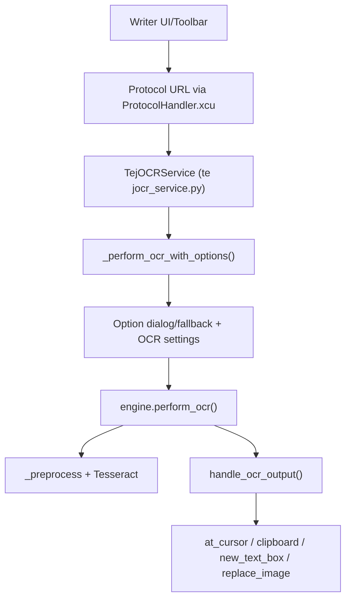
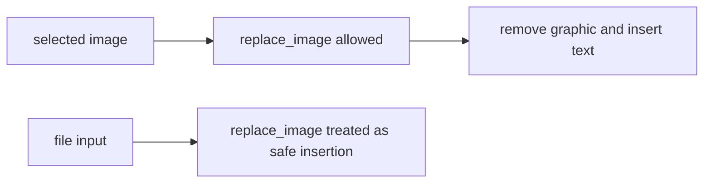

# TejOCR v0.1.7

<div align="center">
  
  <h1>TejOCR</h1>
  <p>OCR inside Writer, with predictable output behavior</p>

  [](https://deepwiki.com/varshneydevansh/TejOCR)
  [](https://github.com/varshneydevansh/TejOCR/releases)
  [](LICENSE)
  [](https://www.libreoffice.org/)
  [](https://github.com/varshneydevansh/TejOCR)
</div>

TejOCR is a **LibreOffice Writer extension** that performs OCR from:

- a Writer-selected image object, or
- a local image file.

The extension then inserts recognized text based on selected output mode with fallbacks for UI/session compatibility.

---

## Runtime in one screen (ASCII)

```text
┌─────────────────────┐
│ Writer UI/Toolbar   │
│ (menu/commands)     │
└──────────┬──────────┘
           v
    ┌───────────────────────┐
    │ UNO dispatch URL       │
    │ (ProtocolHandler.xcu)  │
    └──────────┬────────────┘
               v
      ┌──────────────────────┐
      │ TejOCRService        │
      │ (te jocr_service.py) │
      └─────┬───────┬────────┘
            │       │
            │       v
            │  Settings + Options
            │  (XDL first, fallback input if unavailable)
            │
            v
      OCR source
   selected image | file
            v
      ┌──────────────────────────┐
      │ OCR Engine              │
      │ (tejocr_engine.py)      │
      │ - image export           │
      │ - preprocessing          │
      │ - tesseract OCR attempts  │
      └─────────┬────────────────
                v
      ┌──────────────────────────┐
      │ Output Router           │
      │ (tejocr_output.py)      │
      │ at_cursor | clipboard    │
      │ new_text_box | replace    │
      └──────────────────────────┘
```


```mermaid
flowchart TD
  A["Writer UI/Toolbar"] --> B["Protocol URL via ProtocolHandler.xcu"]
  B --> C["TejOCRService (te jocr_service.py)"]
  C --> D["_perform_ocr_with_options()"]
  D --> E["Option dialog/fallback + OCR settings"]
  E --> F["engine.perform_ocr()"]
  F --> G["_preprocess + Tesseract"]
  F --> H["handle_ocr_output()"]
  H --> I["at_cursor / clipboard / new_text_box / replace_image"]
```

> `replace_image` is only valid for Writer-selected-image flow.

---

## What it supports

- **Input sources**
  - Selected Writer image
  - Local image file
- **Output modes**
  - Insert at cursor
  - Copy to clipboard
  - Insert into new text box
  - Replace selected image (selection-only)
- **Compatibility mode**
  - If UNO dialog UI services are unavailable, TejOCR switches to fallback prompts and still runs OCR.

### Important support note

```text
selected image source -> can use replace_image
file source          -> cannot target an image replacement
                       -> automatically uses insertion-compatible behavior
```


```mermaid
flowchart LR
  A["selected image"] --> B["replace_image allowed"]
  B --> C["remove graphic and insert text"]
  D["file input"] --> E["replace_image treated as safe insertion"]
```

---

## Install

1. Install `TejOCR-0.1.7.oxt` from extension manager.
2. Restart LibreOffice.
3. Open **TejOCR → Settings** and verify dependency status.

---

## Requirements

- LibreOffice 4.0+
- Tesseract (`tesseract` command installed)
- LibreOffice Python packages:
  - `numpy`
  - `pytesseract`
  - `pillow`

### Platform commands

- **macOS**: `brew install tesseract`
- **Linux**: `sudo apt install tesseract-ocr tesseract-ocr-eng`
- **Windows**: install Tesseract (UB Mannheim), then install python deps in LibreOffice Python.

If detection fails, set full Tesseract executable path in Settings.

---

## Typical flows

### A) Selected image

1. Select image in Writer.
2. Open `TejOCR → OCR Selected Image`.
3. Choose language/output/preprocessing.
4. Run and get result.

### B) File image

1. Open `TejOCR → OCR Image from File`.
2. Select a file path.
3. Choose language/output/preprocessing.
4. Run and get result.

---

## Troubleshooting quick wins

### Dependency errors

- Missing python packages: install in LibreOffice Python and restart.
- Missing Tesseract path: verify with Settings and environment/path.

### Inserted text lands at document end

- This happens when saved cursor anchor is not recoverable.
- Use `new_text_box` mode for reliable placement.

### Empty OCR result

- increase contrast/binarization settings,
- scale up (`1.2` to `1.5`),
- verify installed language data.

### Extension card shows raw XML / tiny icon / stale metadata

This usually means metadata cache or manifest mismatch.

1. Quit LibreOffice.
2. Clear `~/Library/Application Support/LibreOffice/*/user/uno_packages/cache/uno_packages/`.
3. Uninstall/reinstall from a freshly built `.oxt`.
4. Restart and recheck Extension Manager details.

---

## Documentation map

Root index:

- `TECHNICAL.md`: architecture + function-level runtime map.
- `CODEMAP.md`: module ownership map.
- `DEVELOPER_GUIDE.md`: build/packaging guidance.
- `FUNCTIONALITY.md`: user workflow.

Deep docs:

- `docs/architecture/overview.md`
- `docs/architecture/dispatch-flow.md`
- `docs/reference/method-map.md`
- `docs/reference/uno-apis.md`
- `docs/flow/selected-image-ocr.md`
- `docs/flow/file-image-ocr.md`
- `docs/reference/output-modes.md`
- `docs/troubleshooting/installation.md`
- `docs/troubleshooting/dialog-fallbacks.md`

Reading order:

`README` → `TECHNICAL` → `docs/architecture` → `docs/flow` → `docs/troubleshooting`

---

## Notes on docs format

All major technical docs are intentionally dual-form:

- ASCII flow blocks for terminal/code review readability.
- Mermaid diagrams for quick visual scanning and review contexts.

