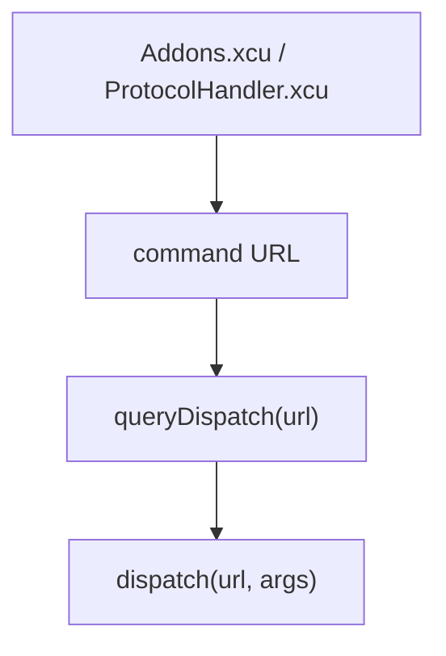
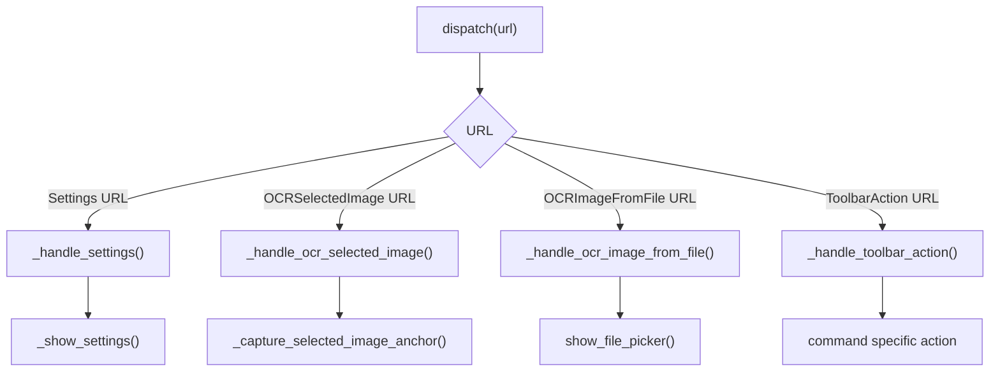
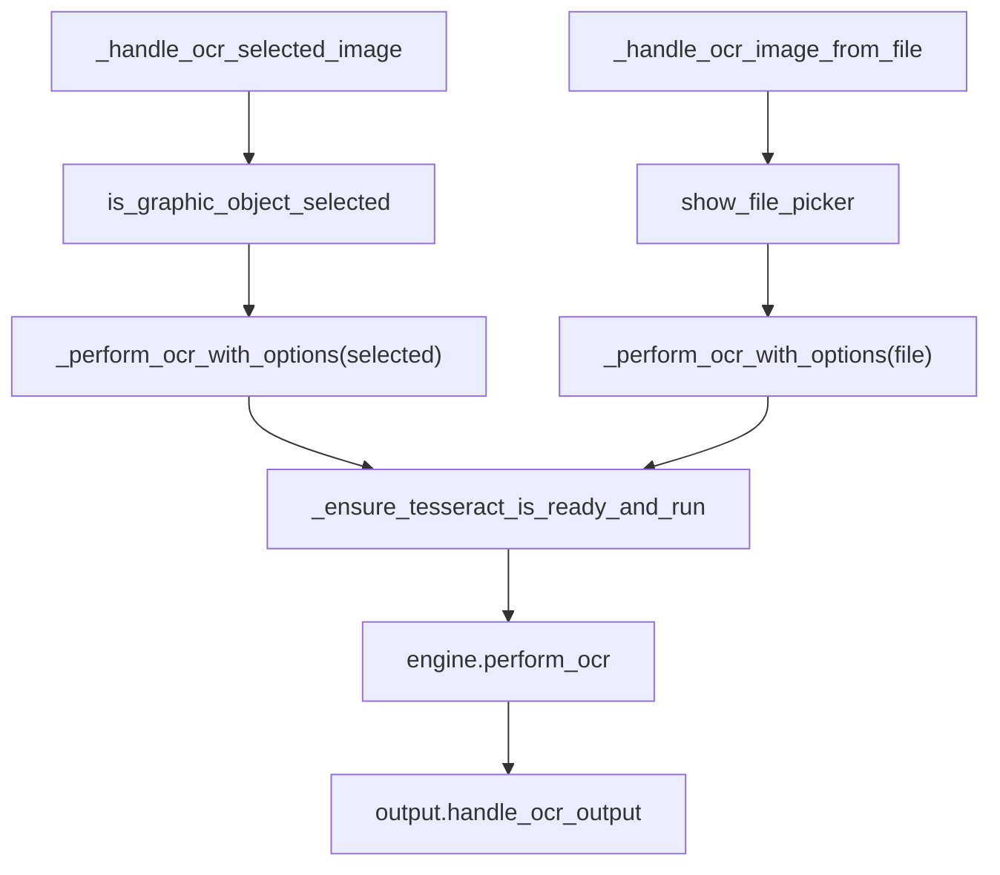
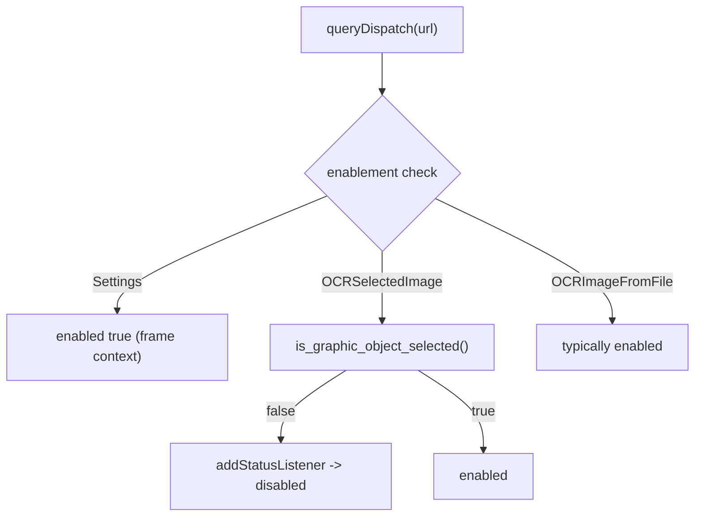
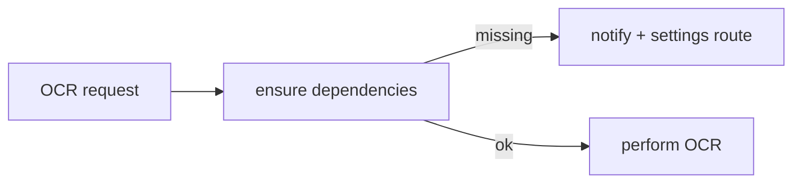

# Dispatch and Runtime Flow (UNO)

This file explains how a Writer command reaches the extension service and then traverses OCR/output execution.

## Protocol entry

```text
Addons.xcu + ProtocolHandler.xcu
   -> maps:
      - uno:org.libreoffice.TejOCR.Settings
      - uno:org.libreoffice.TejOCR.OCRSelectedImage
      - uno:org.libreoffice.TejOCR.OCRImageFromFile
      - uno:org.libreoffice.TejOCR.ToolbarAction
   -> TejOCRService queryDispatch()/dispatch()
```



## Dispatch matrix

```text
dispatch(url)
  -> _handle_settings()
  -> _handle_ocr_selected_image()
  -> _handle_ocr_image_from_file()
  -> _handle_toolbar_action()
```



## OCR dispatch internals

```text
_handle_ocr_selected_image()
  -> is_graphic_object_selected()
  -> _perform_ocr_with_options(source='selected')
  -> ensure_tesseract_is_ready_and_run(...)
  -> engine.perform_ocr(...)
  -> output.handle_ocr_output(...)

_handle_ocr_image_from_file()
  -> pick path via file picker
  -> _perform_ocr_with_options(source='file', image_path=...)
  -> ensure_tesseract_is_ready_and_run(...)
  -> engine.perform_ocr(...)
  -> output.handle_ocr_output(...)
```



## Status enablement

```text
queryDispatch() decides command state
  Settings -> always for Writer contexts used by TejOCR
  OCRSelectedImage -> only enabled when image selection exists
  OCRImageFromFile -> generally enabled where file actions are supported
```



## Dependency and tesseract gate

```text
before OCR execution:
  -> dependency checks
     -> numpy/pytesseract/pillow availability
     -> tesseract executable/path check
  -> if missing:
     -> friendly error + settings path
  -> else:
     -> OCR pipeline continues
```



