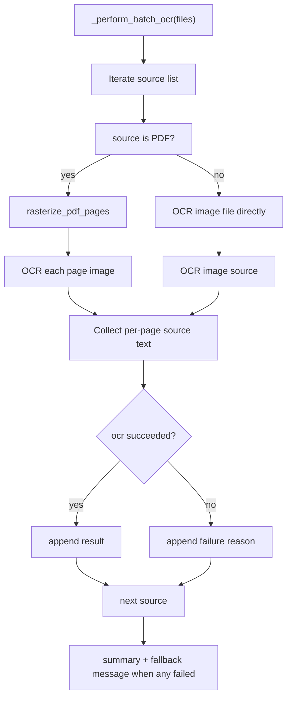
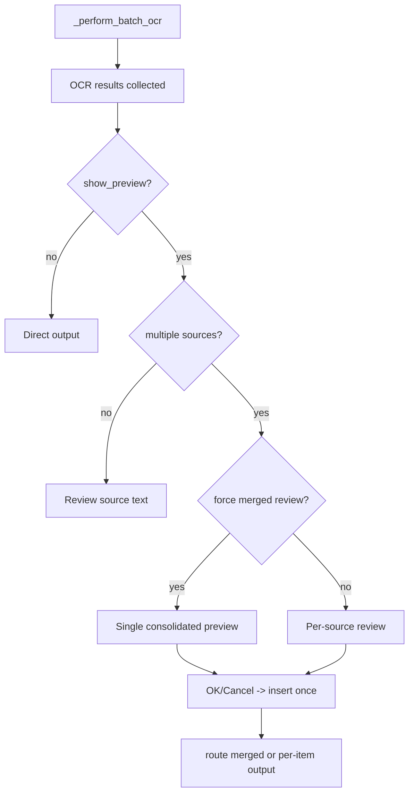

# File Image OCR Flow (No Writer selection required)

## Trigger

User executes:
`OCR Image from File`.

## Complete flow

```text
Command OCR Image from File
  |
  v
_handle_ocr_image_from_file()
  |
  +-- user cancels picker -> return
  |
  +-- images/PDFs selected
       |
       v
  _perform_batch_ocr(file_paths)
       |
       +-- _show_ocr_options_dialog() (or fallback prompt, single options for batch)
       +-- for each file:
             +-- if PDF: rasterize pages to temp images
             +-- for each image/page:
                   +-- _ensure_tesseract_is_ready_and_run(...)
                   +-- engine.extract_text_from_image_file()
                         +-- _preprocess_image()
                         +-- OCR attempt chain
                   +-- collect (filename/page, text) result
             +-- if PDF: cleanup temp images
       +-- if merge enabled (default):
             +-- format consolidated output with headers
             +-- output.handle_ocr_output(replacement_target=None)
                   +-- at_cursor/new_text_box/clipboard
       +-- if merge disabled:
             +-- output.handle_ocr_output(replacement_target=None) per file/page
       +-- success notification
```

%%{init: {"theme":"base","themeVariables":{"primaryColor":"#1f6feb","primaryTextColor":"#ffffff","primaryBorderColor":"#1347a0","lineColor":"#7c3aed","secondaryColor":"#22c55e","tertiaryColor":"#f59e0b","mainBkg":"#dbeafe","background":"#ffffff","textColor":"#0f172a"}}}%%
flowchart TD
  A["OCR Image from File command"] --> B["_handle_ocr_image_from_file"]
  B --> C["show_file_picker"]
  C -->|Cancelled| D["Exit cleanly"]
  C -->|File paths| E["_perform_batch_ocr(file_paths)"]
  E --> F["_show_ocr_options_dialog/fallback"]
  F --> F1["Extract PDF pages (if applicable)"]
  F1 --> G["Loop per image/page"]
  G --> H["_ensure_tesseract_is_ready_and_run"]
  H --> I["extract_text_from_image_file"]
  I --> J["_preprocess_image & OCR attempt loop"]
  J --> K["Collect result"]
  K --> L{"Merge batch results?"}
  L -->|Yes| M["Format single output block"]
  L -->|No| N["Process individual outputs"]
  M --> O["handle_ocr_output(replacement_target=None)"]
  N --> O
  O --> P{mode}
  P -->|at_cursor| Q["insert at cursor"]
  P -->|new_text_box| R["insert text box"]
  P -->|clipboard| S["copy text"]
  Q --> T["Done"]
  R --> T
  S --> T
  D --> T
```

## Source mismatch note

```text
File flow has no selected Writer image object
-> replace_image is not true in-place replacement
-> implementation keeps behavior safe and visible by using insertion/clipboard modes
```

%%{init: {"theme":"base","themeVariables":{"primaryColor":"#1f6feb","primaryTextColor":"#ffffff","primaryBorderColor":"#1347a0","lineColor":"#7c3aed","secondaryColor":"#22c55e","tertiaryColor":"#f59e0b","mainBkg":"#dbeafe","background":"#ffffff","textColor":"#0f172a"}}}%%
flowchart LR
  A["file source OCR"] --> B{"replacement target exists?"}
  B -->|no| C["replace_image treated as insertion branch"]
  C --> D["at_cursor / new_text_box / clipboard"]

## Current implementation notes (v0.1.7+)

### 1) File picker normalization guarantees

TejOCR normalizes file selection to preserve filenames with spaces and commas as single paths.

Important validation point:

- The parser uses URL-boundary splitting and a fragment-repair path for UNO implementations that can return a single filename split into multiple tokens (for example, `...May%203` + `,` + `%202025...`).
- Every rejected/invalid entry is logged and surfaced in the failure summary.
- If a split fragment still exists after repair, it remains visible as a source failure (`File not found`) instead of hiding the error.

```text
Selected raw entries
  -> file:///Users/.../ChatGPT%20Image%20May%203,%202025,%2010_19_30%20PM.png
Resolved
  -> /Users/.../ChatGPT Image May 3, 2025, 10_19_30 PM.png
```

### 2) Branching by source type



### 3) Merge mode and output formatting

- `merge_batch_results = true` (default in current settings): all successful OCR results are emitted as one text block.
  - Includes:
    - Source header per file/page
    - `Source breakdown` section
    - optional `Some sources failed` section (if applicable)
- `merge_batch_results = false`: each successful result uses the selected insert method individually.

### 4) Preview behavior contract

- Preview is optional if `show_preview` is enabled.
- For single-source runs: preview follows source text directly.
- For multi-source runs:
  - Runtime selects preview strategy based on:
    - >2 selected sources (force consolidated preview), or
    - large combined text payload, or
    - absence of UNO multiline editor support.
  - If consolidated preview is chosen, TejOCR shows one merged text block titled like `Review OCR result — 4 files (1 PDF, 3 image)`.
  - If not forced and 2 or fewer sources are selected, TejOCR may show per-source previews.
  - When UNO multiline editor is unavailable, preview is downgraded to a compact message-box confirm and proceeds with insertion.
  - If preview is disabled, output is inserted directly after processing.



```text
Preview output contract
Successes are shown in the merged payload as:
  • Source 1: ChatGPT Image...
  • Source 2: square-image (1) ...
  • Source 1 text headers include `({length} chars)`
Failures
  • ChatGPT Image May 3...png -> File not found
  • ... -> No PDF renderer found
```

### 5) Failure contract

All failed entries are surfaced in logs and summary so users can quickly retry:

- Missing source path
- PDF renderer unavailable
- OCR produced zero usable text

Example summary fields:

```text
OCR complete path (batch merge mode):
Successfully extracted 756 characters from 1 source(s) and added to new text box.
Some sources failed:
• ChatGPT Image May 3...png: File not found
```

Example no-success path:
```text
OCR produced no text across 4 selected source(s).
No PDF renderer found. Install one of:
 - ...
Some sources failed:
• ...
```

When multi-source preview is disabled or canceled:
- If no sources are successfully extracted, no partial insertion occurs.
- If some sources succeed and merge is enabled, successful text is inserted once with a combined output block.
- If merge is disabled, successful sources are inserted per-source until user cancels at per-source review.

### 6) Filename normalization edge case (comma/space split fix)

- `FilePicker` can emit the same file in fragments if the filename contains commas/percent-encoded spaces.
- TejOCR now reassembles split fragments by validating URL-boundary patterns and fragment tokens before decoding.
- Unrepaired fragments stay as explicit failed sources in the summary so users can retry only broken files.

```text
Input tokens
  -> file:///.../ChatGPT%20Image%20May%203,
  -> %202025,%2010_19_30%20PM.png
Recovered path
  -> /.../ChatGPT Image May 3, 2025, 10_19_30 PM.png
```
