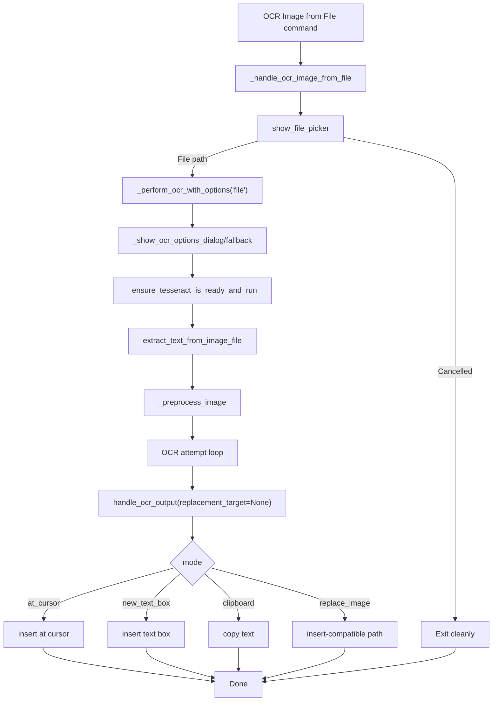
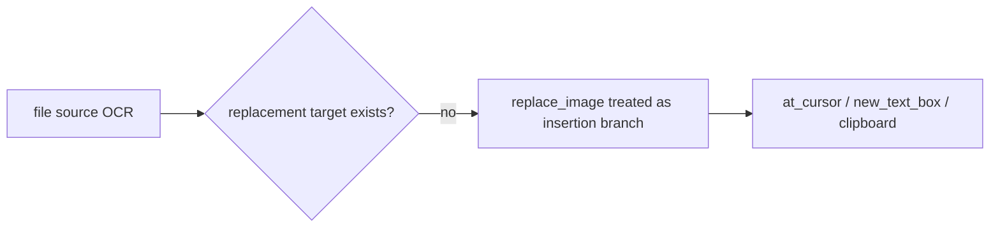

# File Image OCR Flow (No Writer selection required)

## Trigger

User executes:
`OCR Image from File`.

## Complete flow

```text
Command OCR Image from File
  |
  v
_handle_ocr_image_from_file()
  |
  +-- user cancels picker -> return
  |
  +-- image selected
       |
       v
  _perform_ocr_with_options(source='file', image_path)
       |
       +-- _show_ocr_options_dialog() (or fallback prompt)
       +-- _ensure_tesseract_is_ready_and_run(...)
       +-- engine.extract_text_from_image_file()
             +-- _preprocess_image()
             +-- OCR attempt chain
       +-- output.handle_ocr_output(replacement_target=None)
             +-- at_cursor/new_text_box/clipboard
             +-- replace_image -> mapped to safe insertion branch
       +-- success notification
```



## Source mismatch note

```text
File flow has no selected Writer image object
-> replace_image is not true in-place replacement
-> implementation keeps behavior safe and visible by using insertion/clipboard modes
```



