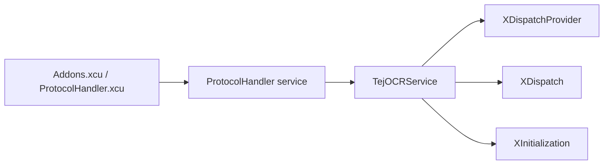
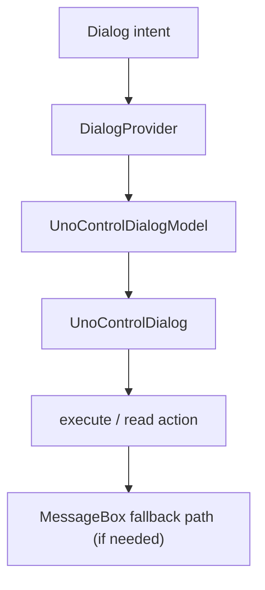
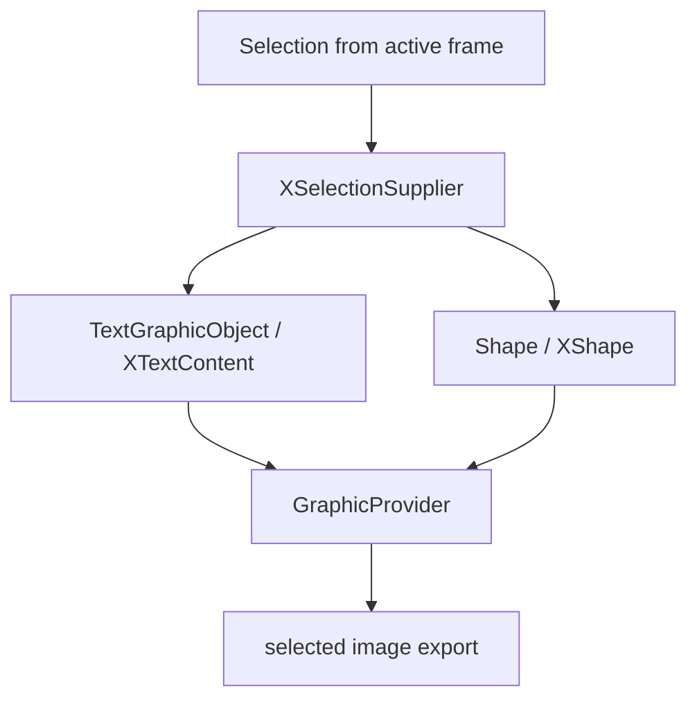
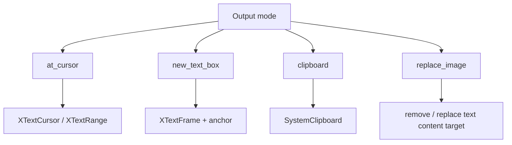
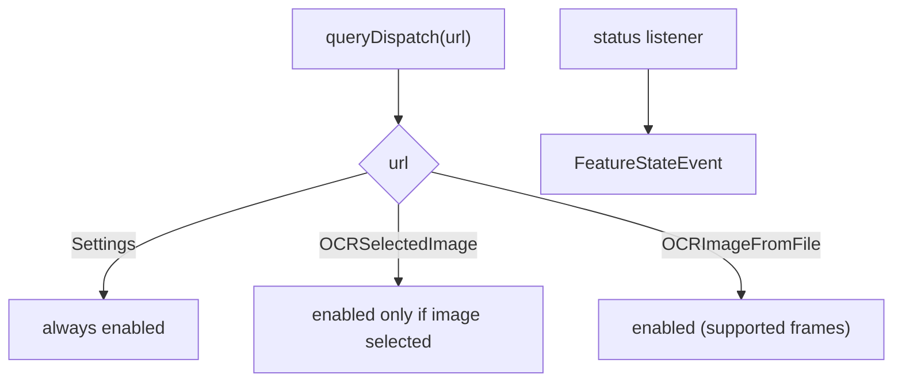
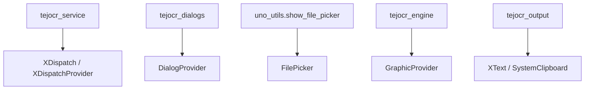

# UNO APIs and LibreOffice Surfaces Used by TejOCR

This reference is intentionally practical: for each subsystem, it shows the UNO services/interfaces that must exist and where they are used.

## 1) Dispatch and registration

```text
Addons.xcu + ProtocolHandler.xcu
   -> com.sun.star.frame.ProtocolHandler
      -> te jocr_service.py (Python service object)
         -> XDispatch / XDispatchProvider / XServiceInfo / XInitialization
```



### API list

- `com.sun.star.frame.ProtocolHandler`
- `com.sun.star.frame.XDispatch`
- `com.sun.star.frame.XDispatchProvider`
- `com.sun.star.lang.XServiceInfo`
- `com.sun.star.frame.XInitialization`
- `com.sun.star.beans.PropertyValue` (dispatch arguments)

## 2) Dialog and fallback message path

```text
Dialog UX
  -> DialogProvider
  -> UnoControlDialogModel / UnoControlDialog
  -> control models
  -> execute
  -> fallback: MessageBox / input APIs if model unavailable
```



### Dialog API list

- `com.sun.star.awt.DialogProvider`
- `com.sun.star.awt.UnoControlDialog`
- `com.sun.star.awt.UnoControlDialogModel`
- `com.sun.star.awt.UnoControlFixedTextModel`
- `com.sun.star.awt.UnoControlButtonModel`
- `com.sun.star.awt.UnoControlEditModel`
- `com.sun.star.awt.UnoControlCheckBoxModel`
- `com.sun.star.awt.UnoControlComboBoxModel`
- `com.sun.star.awt.UnoControlRadioButtonModel`
- `com.sun.star.awt.MessageBoxType`
- `com.sun.star.awt.MessageBoxButtons`
- `com.sun.star.awt.MessageBoxResults`
- `com.sun.star.task.XJobExecutor`
- `com.sun.star.ui.dialogs.FilePicker`
- `com.sun.star.awt.Toolkit`

## 3) Document selection and image extraction

```text
Selection source
  -> XSelectionSupplier
  -> supportsService("com.sun.star.text.TextGraphicObject")
  -> XTextContent / XShape
  -> GraphicProvider / GraphicExporter
```



### Selection API list

- `com.sun.star.view.XSelectionSupplier`
- `com.sun.star.text.TextGraphicObject`
- `com.sun.star.text.XTextContent`
- `com.sun.star.text.XTextCursor`
- `com.sun.star.text.XTextDocument`
- `com.sun.star.drawing.XShape`
- `com.sun.star.drawing.XShapes`
- `com.sun.star.graphic.GraphicProvider`
- `com.sun.star.drawing.GraphicExporter`
- `com.sun.star.graphic.GraphicExportFilter`
- `com.sun.star.beans.PropertyValue`

## 4) Output insertion and clipboard

```text
Output mode routing
  -> at_cursor: text cursor APIs
  -> new_text_box: XTextFrame / AS_CHARACTER anchor
  -> clipboard: SystemClipboard + transferable
  -> replace_image: remove selected target + insert text
```



### Output API list

- `com.sun.star.text.XText`
- `com.sun.star.text.XTextCursor`
- `com.sun.star.text.XTextRange`
- `com.sun.star.text.XTextFrame`
- `com.sun.star.text.TextContentAnchorType`
- `com.sun.star.datatransfer.clipboard.SystemClipboard`
- `com.sun.star.datatransfer.XTransferable`
- `com.sun.star.datatransfer.DataFlavor`

## 5) Runtime status and compatibility

```text
Feature queries and enablement
  -> queryDispatch(url)
  -> status listener registration
  -> FeatureStateEvent updates
```



### Status API list

- `com.sun.star.frame.XStatusListener`
- `com.sun.star.frame.FeatureStateEvent`

## 6) Configuration and packaging surfaces

- `com.sun.star.configuration.ConfigurationProvider`
- `com.sun.star.configuration.ConfigurationUpdateAccess`
- `com.sun.star.configuration.ConfigurationAccess`
- `com.sun.star.util.PathSubstitution`

Used for:
- extension settings persistence,
- package/runtime compatibility checks,
- path resolution for dependencies and user data.

## 7) Method → UNO mapping matrix

```text
module/function                         -> UNO service/interface
--------------------------------------------------------------------------------
tejocr_service.queryDispatch/dispatch   -> XDispatchProvider / XDispatch
tejocr_service.addStatusListener        -> XStatusListener
tejocr_dialogs handlers                 -> DialogProvider + Dialog models
tejocr_interactive_dialogs.*            -> MessageBox / fallback input
tejocr_engine._export_graphic_to_file    -> GraphicProvider/GraphicExportFilter
tejocr_engine._get_image_from_selection  -> XSelectionSupplier + TextGraphicObject
tejocr_output.*                         -> XText/XTextCursor/TextFrame/SystemClipboard
uno_utils.show_file_picker               -> FilePicker
```



