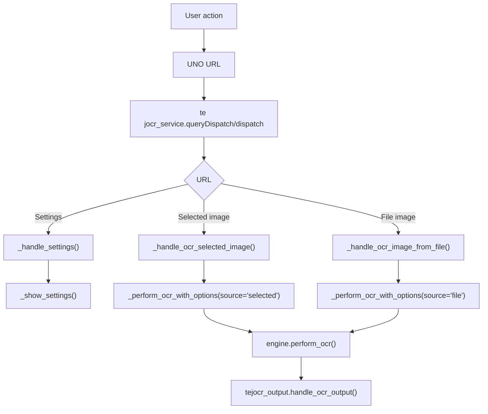
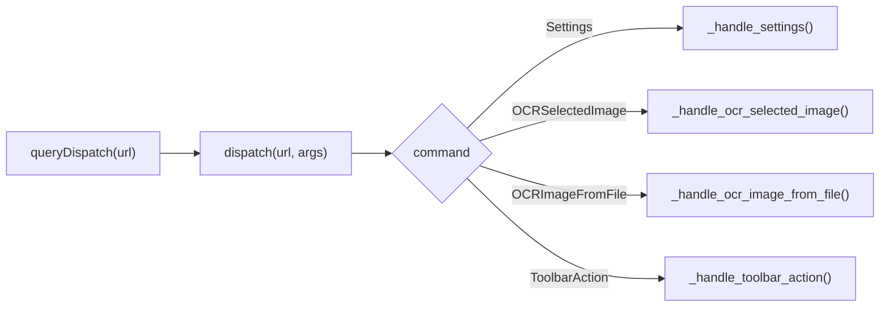
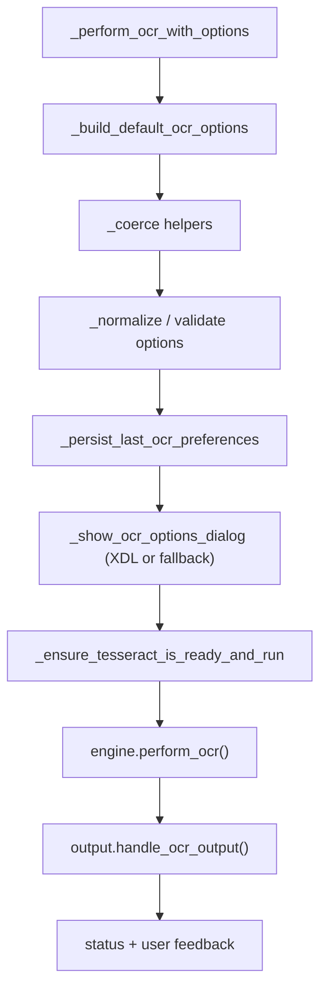
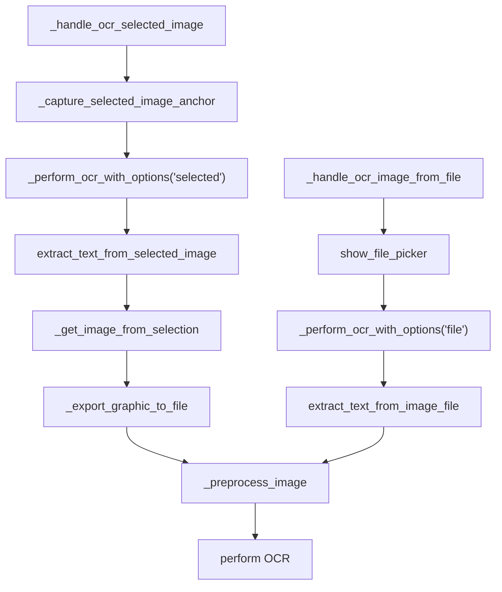
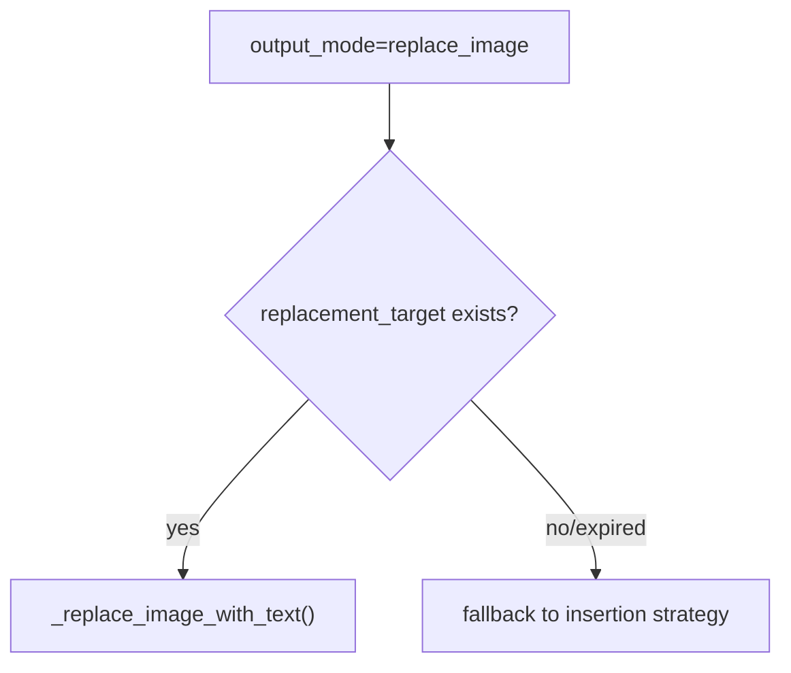
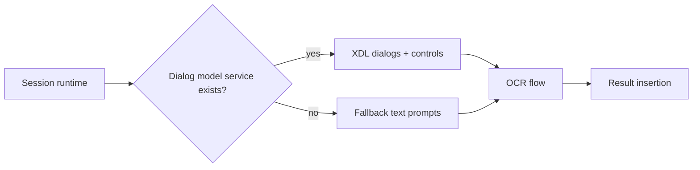

# TejOCR Technical Documentation

This document is the concise technical entry point for how TejOCR executes OCR from user action to UNO insertion.

## On-device runtime flow (high signal)

```text
User action (menu/toolbar)
    |
    v
Protocol URL (UNO handler)
    |
    v
TejOCRService.queryDispatch/dispatch
    |
    +-- _handle_settings()
    +-- _handle_ocr_selected_image()
    +-- _handle_ocr_image_from_file()
    |
    v
Option capture + dependency checks
    |
    v
OCR pipeline (engine.perform_ocr)
    |
    v
Text placement (handle_ocr_output)
```



## Method entry points and behavior

### `tejocr_service.py`

- `queryDispatch(url, props, frame)` and `dispatch(url, args, state)` are the entry points from LibreOffice.
- Each dispatch branch maps to one concrete handler.

```text
Service dispatch map

Settings URL                    -> _handle_settings()
OCRSelectedImage URL            -> _handle_ocr_selected_image()
OCRImageFromFile URL             -> _handle_ocr_image_from_file()
ToolbarAction URL                -> _handle_toolbar_action()
```



### `_perform_ocr_with_options()` pipeline

```text
_perform_ocr_with_options(source, image_path?, options, output_mode)
   -> _build_default_ocr_options(ctx)
   -> _coerce_bool / _coerce_scale / _coerce_output_mode
   -> _normalize_language_request
   -> _persist_last_ocr_preferences
   -> _show_ocr_options_dialog() (UI path; falls back if unavailable)
   -> _ensure_tesseract_is_ready_and_run(...)
   -> lazy-load engine and output modules
   -> engine.perform_ocr(...)
   -> output.handle_ocr_output(...)
   -> success/error reporting + logs
```



## Selected image vs file OCR: function split

```text
Selected image path:
  _handle_ocr_selected_image
    -> _capture_selected_image_anchor (for safe fallback insertion)
    -> _perform_ocr_with_options(source='selected')
    -> extract_text_from_selected_image
       -> _get_image_from_selection
       -> _export_graphic_to_file
       -> _preprocess_image
       -> OCR attempt chain

File path:
  _handle_ocr_image_from_file
    -> show_file_picker
    -> _perform_ocr_with_options(source='file', image_path=...)
    -> extract_text_from_image_file
       -> _preprocess_image
       -> OCR attempt chain
```



### Replace-mode nuance (important)

`replace_image` works only where a Writer image target exists (selected-image mode).

```text
source=selected, target exists -> replace_image branch executes
source=file or target missing  -> safe insertion path (at_cursor/new_text_box/clipboard)
```



## Core dependencies and where they are used

### `tejocr_engine.py`
- `perform_ocr`
- `extract_text_from_selected_image`
- `extract_text_from_image_file`
- `_get_image_from_selection`
- `_export_graphic_to_file`
- `_preprocess_image`

### `tejocr_output.py`
- `handle_ocr_output`
- `_resolve_insertion_cursor`
- `_insert_text_at_cursor`
- `create_text_box_with_text`
- `_replace_image_with_text`
- `copy_text_to_clipboard`

### `uno_utils.py`
- service creation and UNO helpers,
- setting persistence,
- dialog/model checks,
- message box and input fallbacks,
- file picker and clipboard helpers.

## Execution trace references

- `docs/flow/selected-image-ocr.md`
- `docs/flow/file-image-ocr.md`
- `docs/architecture/dispatch-flow.md`
- `docs/reference/method-map.md`
- `docs/reference/uno-apis.md`
- `docs/reference/output-modes.md`

## Runtime compatibility behavior on user device

```text
If dialog model service is available:
  - XDL settings/options dialogs shown
  - richer interaction and controls

If dialog model service unavailable in session:
  - supports_uno_dialog_model() caches negative result
  - settings/option previews degrade to editable text prompts
  - OCR and output still run (using persisted defaults)
```



